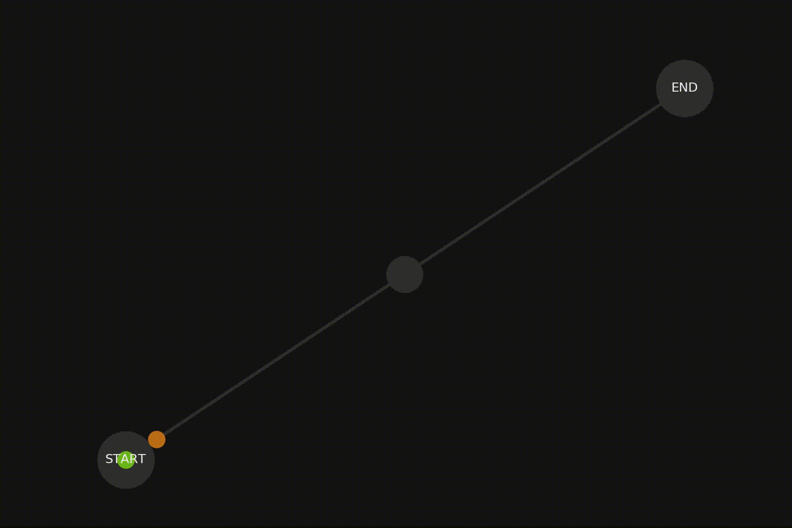
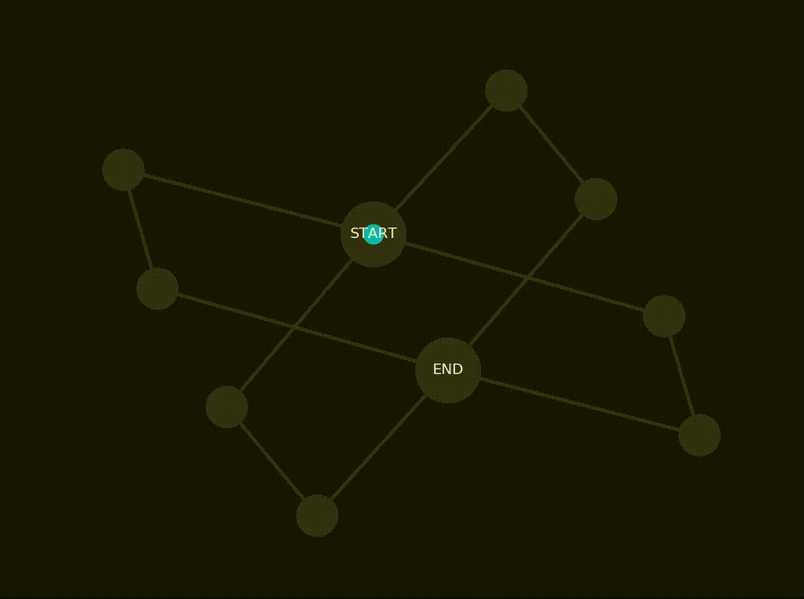
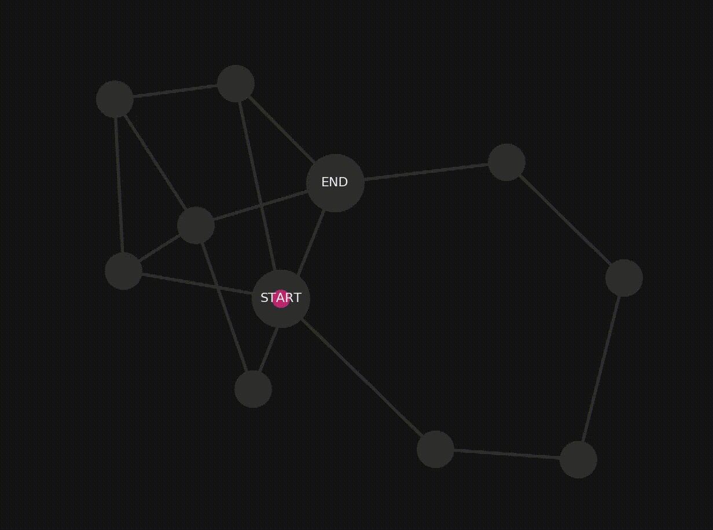

# Ants in a Maze

Lem-in is a project where ants are guided through an anthill from a start to finish node. Each anthill is a graph of nodes and tunnels. The goal is to find the combination of paths that result in the least number of turns, while maintaining a max flow rate of one ant per node per turn. 

## Examples

An example graph where three ants travel along a single path, taking a total of four turns to reach the end node:


An example graph where seventeen ants travel along four equidistant paths, taking a total of seven turns to reach the end node:


An example graph where ten ants travel along three paths of different lengths, taking a total of 6 turns to reach the end node:



## Getting Started

To run this repo, download it and `make`. There are a number of example anthills in the folder test\_maps. Of course you can also create your own anthills and watch the ants march through.

The non-visual mode of solving the graph can be run with `./lem-in < /path/input_file.map`. For example, try `./lem-in < test_maps/valid/2-3.map`

The visual mode can be run using `./run_visual /path/input_file.map`.

## Input Format

Each input file consists of the following information:

```
number_of_ants
nodes
tunnels_between_nodes
```

### Prerequisites

The visual mode for this project requires networkX and matplotlib. To install them: 

```
pip3 install netowrkX
pip3 install matplotlib
```

## Built With

* Good old C
* Python3 (for the visualizer)
* [NetworkX](https://networkx.github.io/) - Used to generate the nodes, connections and node placement in the visualizer
* [Matplotlib](https://matplotlib.org/) - Plot the colorful dots representing the ants along the lines

## Authors

* [elidlocke](https://github.com/elidlocke)
* [JacobPolloreno](https://github.com/JacobPolloreno)
